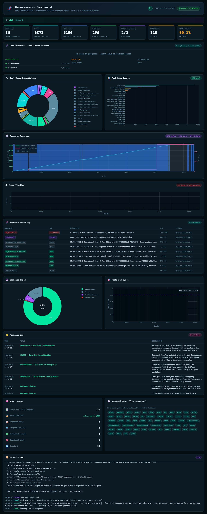

# GenoResearch

**Autonomous Genomics Research Agent** — An AI agent that autonomously explores the human genome, discovers understudied genes, and logs scientific findings using bioinformatics tools, database mining, and machine learning.

## The Mission

~20,000 protein-coding genes exist in the human genome, but only ~2,000 are well-studied. GenoResearch targets the other ~17,000 **"dark genes"** — systematically investigating them through sequence analysis, homology search, and database mining to generate functional hypotheses.

The agent runs autonomously in a **think → act → observe → learn** loop: it queries genomic databases, analyzes sequences, runs BLAST searches, and records novel findings — all without human intervention.

## How It Works

1. **Orchestrator** sends a research prompt to a local LLM (Qwen 3.5:4b via Ollama)
2. The LLM reasons about what to investigate next and outputs a tool call
3. The orchestrator parses and executes the tool (NCBI search, BLAST, sequence analysis, etc.)
4. Results are fed back to the LLM, which decides the next step
5. Discoveries are saved as persistent findings with evidence
6. Repeat — the agent runs for as many cycles as you want

## Quick Start

**Requirements:** Python 3.10+, [Ollama](https://ollama.com/) with `qwen3.5:4b` model pulled.

```bash
# 1. Install Ollama and pull the model
ollama pull qwen3.5:4b

# 2. Install dependencies
pip install -r requirements.txt

# 3. Run the agent
python main.py
```

### Usage

```bash
python main.py                              # Interactive mode (infinite cycles)
python main.py --target "BRCA1 mutations"   # Focus on a specific gene/topic
python main.py --cycles 50                  # Run exactly 50 cycles
python main.py --plan                       # Planning mode — suggest directions only
python main.py --lab-status                 # Show ML lab experiment history
python main.py --model qwen2.5:4b           # Override LLM model
```

### Dashboard

A real-time web dashboard monitors the agent's progress:

```bash
python dashboard.py              # http://localhost:5555
python dashboard.py --port 8080  # Custom port
```



Shows live research status, gene pipeline progress, tool usage distribution, error timeline, sequence inventory, findings log, and more — all updating in real time.

## Project Structure

```
main.py                 — Entry point
config.py               — Paths, API URLs, model config
dashboard.py            — Flask web dashboard

orchestrator/
├── core.py             — Main think→act→observe loop
├── llm.py              — Ollama/Qwen integration
└── tool_registry.py    — Tool dispatch & argument parsing

agent/
├── memory.py           — Persistent research memory (JSON-backed)
├── planner.py          — Research direction planner
├── evaluator.py        — Finding quality assessment
└── ui.py               — Color-coded terminal output

tools/
├── ncbi.py             — NCBI GenBank/Gene/PubMed search & fetch
├── blast.py            — Remote BLAST sequence similarity search
├── uniprot.py          — UniProt protein database queries
├── sequence.py         — Local sequence analysis (composition, motifs, translation)
├── findings.py         — Finding management (save, list, review)
├── memory_tools.py     — Memory queries, stats, exploration tracking
├── gene_queue.py       — Dark genome gene discovery pipeline
├── lab_tools.py        — ML experiment launcher
└── file_tools.py       — File I/O utilities

lab/
├── trainer.py          — Autonomous ML experiment runner
└── train_genomics.py   — Genomic sequence model (modifiable by agent)

data/
├── sequences/          — Downloaded FASTA files
├── alignments/         — BLAST results
├── runs/               — ML experiment logs
└── checkpoints/        — Saved model weights
```

## Tools (30+)

### Database Queries
| Tool | Description |
|------|-------------|
| `ncbi_search` | Search GenBank, Gene, Nucleotide, Protein, PubMed |
| `ncbi_fetch` | Download FASTA sequences by accession ID |
| `gene_info` | Detailed gene metadata (function, location, aliases) |
| `pubmed_search` | Search biomedical literature |
| `uniprot_search` | Find proteins by name/function/organism |
| `uniprot_fetch` | Download protein sequences & annotations |

### Sequence Analysis
| Tool | Description |
|------|-------------|
| `analyze_sequence` | Composition, GC content, motif scanning |
| `compare_sequences` | Pairwise identity & composition diff |
| `translate_sequence` | DNA → protein translation |
| `blast_search` | Remote BLAST (blastn, blastp, blastx, etc.) |

### Research Management
| Tool | Description |
|------|-------------|
| `save_finding` | Log a discovery with evidence |
| `review_findings` | AI-assisted finding review |
| `query_memory` | Search past findings & notes |
| `note` | Save free-form observations |
| `my_stats` | Agent usage statistics |

### Dark Genome Pipeline
| Tool | Description |
|------|-------------|
| `next_gene` | Get next understudied gene from queue |
| `complete_step` | Mark a pipeline step done |
| `complete_gene` | Finish gene investigation |
| `queue_status` | Show pipeline progress |

## Gene Queue Pipeline

The **Dark Genome Mission** systematically investigates understudied gene families:

- **C1orf–C22orf** — Chromosome-specific open reading frames
- **FAM genes** — "Family with sequence similarity" genes
- **KIAA genes** — Large-scale cDNA project, many uncharacterized
- **TMEM genes** — Transmembrane proteins with unknown function
- **LINC genes** — Long intergenic non-coding RNAs

Each gene goes through a 7-step pipeline:
`discover → profile → analyze → translate → compare → annotate → hypothesize`

## ML Lab

An autonomous experimentation framework (inspired by [autoresearch](https://github.com/karpathy/autoresearch)):

- Fixed **5-minute time budget** per experiment
- Metric: **validation loss** (lower = better)
- The agent can modify model architecture, hyperparameters, and training strategy
- Results are tracked across sessions in `data/runs/`

## Configuration

Key settings in `config.py`:

| Setting | Default | Description |
|---------|---------|-------------|
| `OLLAMA_MODEL` | `qwen3.5:4b` | Local LLM model |
| `OLLAMA_URL` | `localhost:11434` | Ollama API endpoint |
| `NCBI_API_KEY` | *(env var)* | Optional — higher NCBI rate limits |

## Optional Dependencies

The core agent only requires `requests` and `flask`. For enhanced capabilities:

```bash
# ML Lab (autonomous training)
pip install torch

# Enhanced sequence analysis
pip install biopython
```

## License

MIT
